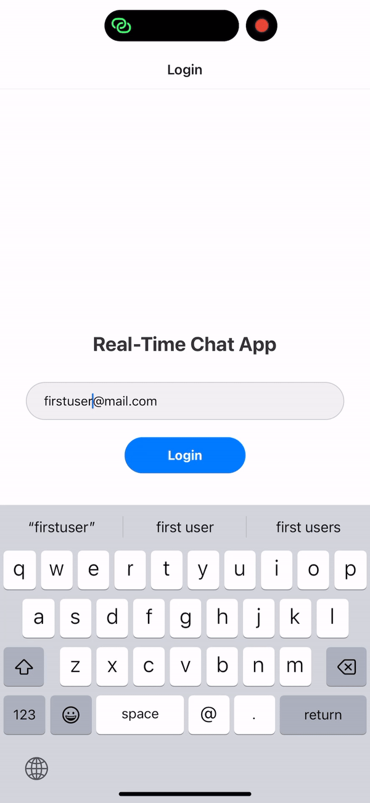
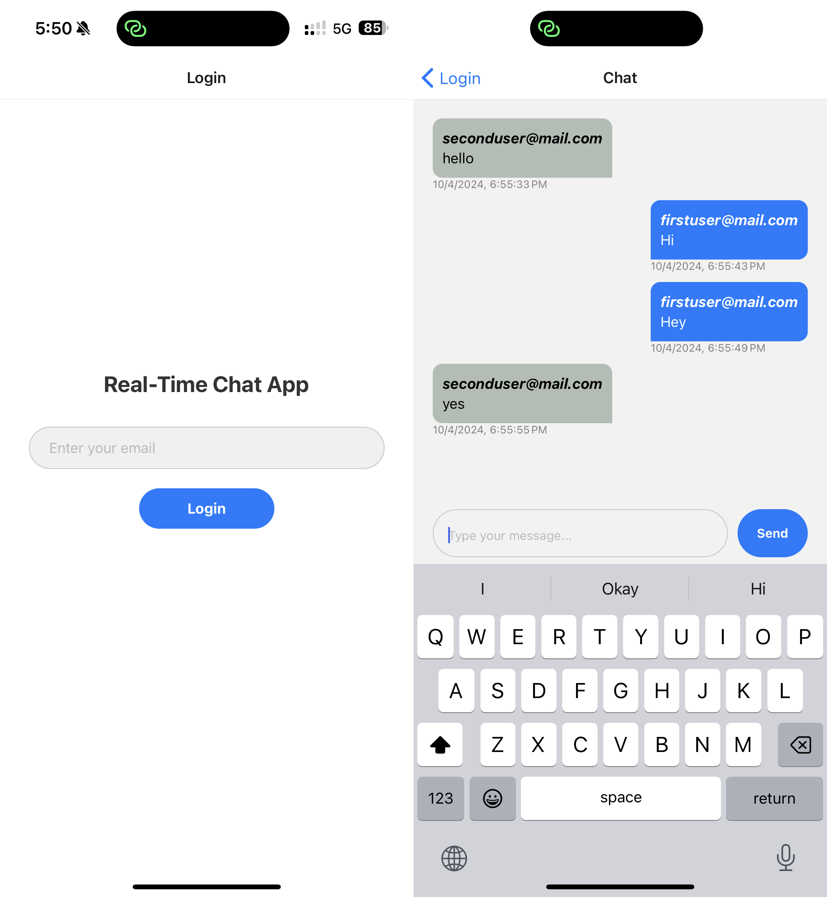

# Real-Time Chat App

## Description

This is a real-time chat application built with React Native, Expo, and Firebase. It enables users to join chat rooms and send/receive messages in real-time. The login process is simplified, requiring only an email address with basic validation.

## Screenshots

## Features

- Simplified login with email validation
- Real-time chat interface
- Firebase integration for data storage and synchronization
- Expo for easier development and testing

## Installation

To run this application locally, follow these steps:

1. Clone the repository to your local machine:
git clone https://github.com/Rishu2505/Real-Time-Chat-App.git

2. Navigate to the project directory:

3. Install dependencies using npm or yarn:
npm install
or
yarn install

4. Set up Firebase:
   - Create a Firebase project on the Firebase Console.
   - Replace the `firebaseConfig` object in `App.js` with your Firebase project configuration.
   - Enable either Firebase Realtime Database or Firestore.
   - Set up Firebase authentication if needed (optional for this project).

## Usage

1. Start the Expo development server:

yarn start
or
npx expo start

2. Use the Expo client on your mobile device to scan the QR code from the terminal, or use an emulator to run the app on your computer.

3. Enter your email address to log in and start chatting.

## Folder Structure

- `App.js`: Main entry point of the application.
- `src/`: Contains all functions/screens.
- `screens/`: Contains different screens of the app (e.g., login screen, chat screen).
- `firebase/`: Contains Firebase configuration and setup.
- `assets/`: Contains static assets such as images and fonts.
- `.env/`: This file contains all firebase info that we need to replace with your app information from firebase i am pushing my details at the moment to show you chat functionality working at my end.
## Contributing

Contributions are welcome! If you find any bugs or have suggestions for improvements, feel free to open an issue or create a pull request.

## License

This project is licensed under the MIT License - see the [LICENSE](LICENSE) file for details.
